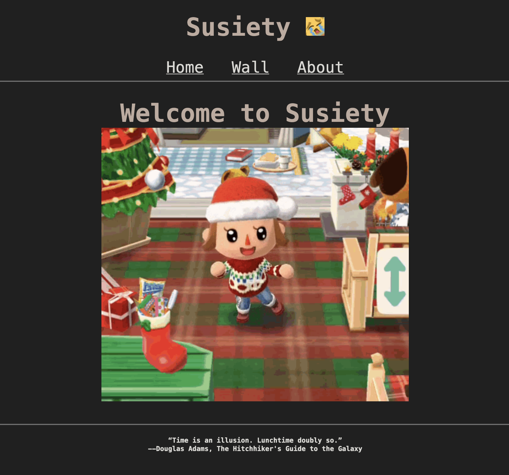
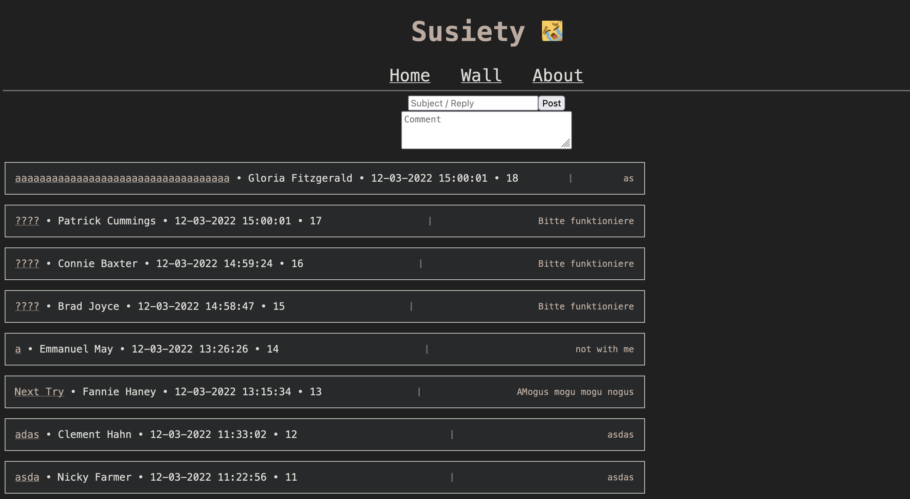
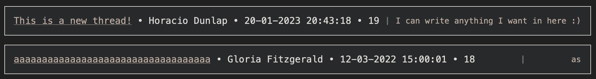
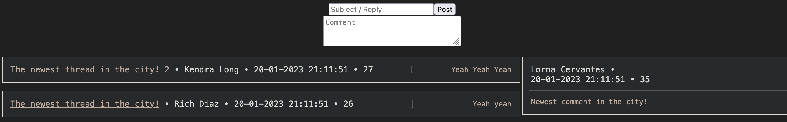

# susiety.net  
Personal comunity page for me and my friends, written in Flask.

## How the Wall works

The Wall is the main page of the site. You can either create a new thread or comment on an existing one.

### Creating a new thread

First you have to choose a name for the thread and if you can also add a little text to the description of the thread.

After you clicked *Post* a thread will appear!

### Commenting on a existing thread

At the end of every thread is a number which indicates the **id** of the thread.

Use this number to indicate which thread you're going to reply to and write your comment.

After you pressed *Post* a new comment will appear!

